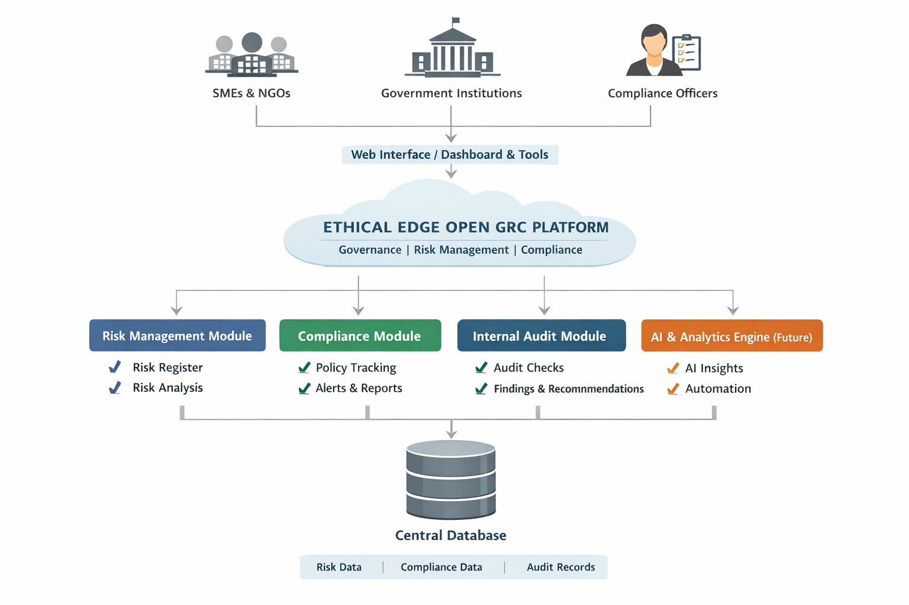

# Ethical Edge GRC

## 📖 Overview

Ethical Edge GRC is a Governance, Risk, and Compliance (GRC) platform designed to help organizations manage risk, ensure compliance, and strengthen governance structures through automation and intelligent insights.
## 🏗️ System Architecture
## ⚙️ Key Features

- Risk Assessment & Management
- Compliance Tracking
- Policy & Document Management
- Audit & Reporting Tools
- Real-time Monitoring & Alerts

