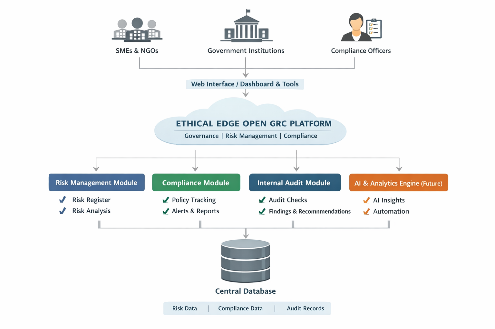

# Cognitive GRC Engine – AI-Powered Children Resilience Support Platform

**Empowering Child-Centred Climate Resilience Through Governance, Risk, Compliance and Artificial Intelligence.**

---


## 📖 Executive Overview

The **Cognitive GRC Engine** is an open-source, AI-powered Climate Resilience Decision Support Platform developed by **Ethical Edge GRC Consulting (Pty) Ltd**.

The platform enables governments, schools, healthcare facilities, humanitarian organizations and development partners to identify, assess, prioritize and respond to climate-related risks affecting children.

By combining climate intelligence, facility assessments, artificial intelligence and governance-by-design principles, the platform transforms environmental and operational data into actionable insights that strengthen preparedness, resilience and evidence-based decision-making.

Developed under the **Apache License 2.0**, the Cognitive GRC Engine supports UNICEF's vision for **Digital Public Goods** through open-source innovation, interoperability, transparency and responsible AI.

## 🏗️ Development Status

The **Cognitive GRC Engine** is an actively evolving open-source Climate Resilience Decision Support Platform developed by **Ethical Edge GRC Consulting (Pty) Ltd**. The platform is designed to help governments, humanitarian organizations, schools, healthcare facilities, and development partners identify, assess, prioritize, and respond to climate-related risks affecting children through intelligent, data-driven decision support.

### 🎯 Current Development Focus

- 🌍 AI-Powered Climate Risk Assessment
- 🏫 Facility Assessment Engine
- 👶 Child Vulnerability Index (CVI)
- 🌦️ Climate Data Integration
- 📊 Climate Risk Intelligence
- 🤖 AI Decision Support
- 📈 Interactive Dashboards
- 🔗 Secure REST APIs
- 🔍 Explainable AI
- 🛡️ Secure Audit Logging

### 🎯 Project Vision

To deliver a secure, scalable, and interoperable open-source Digital Public Good that empowers governments and humanitarian organizations to strengthen child-centred climate resilience through Governance, Risk, Compliance (GRC), and Artificial Intelligence.

The Cognitive GRC Engine is being developed with a strong emphasis on transparency, interoperability, responsible AI, and evidence-based decision-making, enabling institutions to better prepare for, respond to, and recover from climate-related challenges affecting vulnerable communities.

## 🚀 Getting Started

The Cognitive GRC Engine is an open-source platform designed to help governments, humanitarian organizations, schools, and healthcare facilities assess climate-related risks affecting children.

### Prerequisites

- Python 3.11+
- Git
- Docker (optional)
- PostgreSQL (recommended)

### Clone the Repository

```bash
git clone https://github.com/Motlogelwa41-byte/ethical-edge-open-grc.git
cd ethical-edge-open-grc
```
## ⚙️ Installation

### 1. Create a Virtual Environment

```bash
python -m venv .venv
```

### 2. Activate the Virtual Environment

**Windows**
```bash
.venv\Scripts\activate
```

**Linux/macOS**
```bash
source .venv/bin/activate
```

### 3. Install Dependencies

```bash
pip install -r requirements.txt
```

### 4. Configure Environment Variables

Copy the example environment file and update it with your settings.

```bash
cp .env.example .env
```

### 5. Start the Application

```bash
uvicorn app.main:app --reload
```

The API will be available at:

- **Application:** http://127.0.0.1:8000
- **Swagger UI:** http://127.0.0.1:8000/docs
- **ReDoc:** http://127.0.0.1:8000/redoc

---
## 📁 Project Structure

```text
ethical-edge-open-grc/
├── app/                    # FastAPI application source
│   ├── api/                # REST API endpoints
│   ├── core/               # Core application logic
│   ├── models/             # Data models
│   ├── services/           # Business services
│   ├── observers/          # Observation and monitoring modules
│   └── main.py             # Application entry point
├── data/                   # Sample datasets and climate data
├── database/               # Database utilities and migrations
├── docs/                   # Project documentation
├── templates/              # Project templates
├── uploads/                # Uploaded files
├── Project_Documents/      # Proposal and supporting documents
├── requirements.txt        # Python dependencies
├── Dockerfile              # Docker configuration
├── docker-compose.yml      # Docker Compose configuration
└── README.md               # Project documentation
```
## 📡 API Documentation

The Cognitive GRC Engine exposes RESTful APIs built with FastAPI.

After starting the application, interactive API documentation is available at:

| Service | URL |
|---------|-----|
| Swagger UI | http://127.0.0.1:8000/docs |
| ReDoc | http://127.0.0.1:8000/redoc |

### Example Endpoints

| Method | Endpoint | Description |
|---------|----------|-------------|
| GET | `/` | API status |
| GET | `/health` | Health check |
| GET | `/api/v1/dashboard/summary` | Dashboard summary |
| GET | `/api/v1/risks` | List risks |
| POST | `/api/v1/risks` | Create a new risk |
| GET | `/api/v1/organizations` | List organizations |
| POST | `/api/v1/organizations` | Create an organization |

> **Note:** Available endpoints may vary depending on the enabled modules and the current development branch.

## 📸 Screenshots

The following images showcase the Cognitive GRC Engine in development.

### System Architecture



### Dashboard Preview

> Dashboard screenshots will be added as the platform matures.

### Climate Risk Assessment

> Climate Risk Assessment screenshots coming soon.

### Child Vulnerability Index (CVI)

> CVI dashboard screenshots coming soon.

## 🤝 Contributing

We welcome contributions from developers, researchers, climate experts, GRC professionals, and humanitarian organizations.

To contribute:

1. Fork the repository.
2. Create a feature branch.
3. Commit your changes.
4. Push your branch.
5. Open a Pull Request.

Please ensure that:
- Code follows project standards.
- New features include tests where applicable.
- Documentation is updated for significant changes.
- Pull requests include a clear description of the proposed changes.

---

## ⚙️ Core Technical Architecture

The Cognitive GRC Engine is designed as a secure, scalable and cloud-native platform.

### Backend

- FastAPI
- Python

### Frontend

- React
- HTML5
- JavaScript

### Database

- PostgreSQL
- PostGIS

### Artificial Intelligence

- Climate Risk Analytics
- Child Vulnerability Index (CVI)
- Explainable AI
- Retrieval-Augmented Generation (RAG)

### Security

- OAuth 2.0
- JWT Authentication
- Audit Logging
- Role-Based Access Control (RBAC)

### Deployment

- Docker
- Docker Compose
- Cloud Native (AWS / GCP)

---

## 💡 Core Platform Capabilities

- Facility Assessment
- Climate Data Integration
- Child Vulnerability Index (CVI)
- Climate Risk Assessment
- AI Decision Support
- Explainable Recommendations
- Interactive Dashboards
- Open REST APIs
- Secure Audit Trail
- Digital Public Good Architecture

---

## 🚀 Development Roadmap

- [x] Platform Architecture
- [x] FastAPI Backend
- [x] Database Design
- [ ] Climate Intelligence Engine
- [ ] Child Vulnerability Index
- [ ] Facility Assessment Module
- [ ] AI Recommendation Engine
- [ ] Interactive Dashboard
- [ ] Pilot Deployment
- [ ] UNICEF MVP Release

---
## 📬 Support & Contact

For questions, feature requests, or collaboration opportunities, please reach out:

- **Organization:** Ethical Edge GRC Consulting (Pty) Ltd
- **Project:** Cognitive GRC Engine – AI-Powered Children Resilience Support Platform
- **Website:** https://www.ethicaledgegrcconsulting.com

If you find this project useful, please consider:
- ⭐ Starring the repository
- 🐛 Reporting issues
- 💡 Suggesting new features
- 🤝 Contributing through pull requests

## 🌍 Digital Public Good

The Cognitive GRC Engine is being developed as an **Open Source Digital Public Good** under the **Apache License 2.0**, promoting transparency, interoperability, collaboration and long-term sustainability.

---

## 🤝 Organization

**Ethical Edge GRC Consulting (Pty) Ltd**

Botswana

Website: https://www.ethicaledgegrcconsulting.com

---

**Project:** Cognitive GRC Engine – AI-Powered Children Resilience Support Platform

**Status:** Active Development
